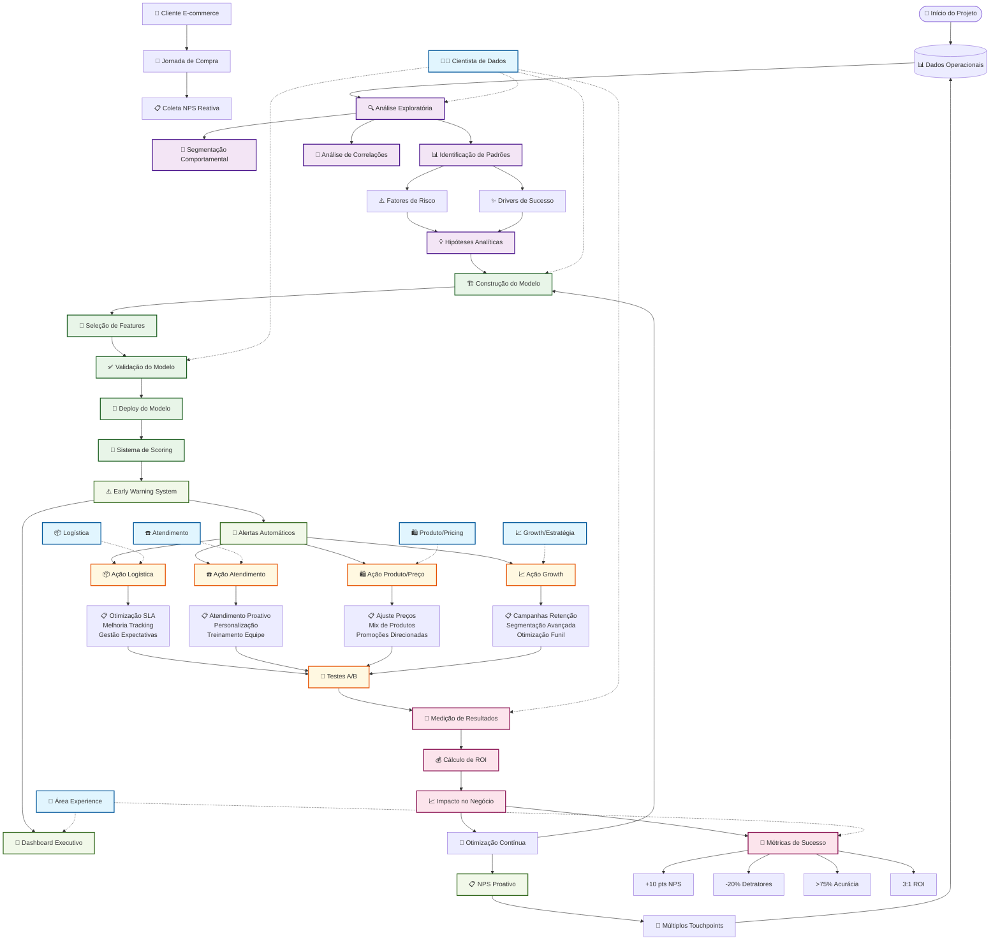

# Brainstorm: Análise Preditiva de NPS para E-commerce

## 📋 Entendimento do Problema de Negócio

### Problema Central
- **Contexto**: E-commerce em crescimento acelerado com alta variabilidade no Net Promoter Score (NPS)
- **Questão de negócio**: Identificar fatores operacionais que influenciam a satisfação do cliente
- **Limitação atual**: NPS coletado apenas após o encerramento da jornada de compra (reativo)
- **Objetivo**: Transformar dados operacionais em insights acionáveis para ação proativa

### Por que o NPS é Importante para E-commerce?

#### 1. **Indicador de Fidelidade**
- Mede a probabilidade de recomendação da marca
- Correlação direta com lifetime value do cliente
- Preditor de crescimento orgânico via word-of-mouth

#### 2. **Métricas de Performance**
- Benchmark contra concorrentes
- Indicador leading de performance financeira
- Ferramenta de gestão da experiência do cliente

#### 3. **Direcionamento Estratégico**
- Identificação de pontos de melhoria na jornada
- Priorização de investimentos em CX
- Segmentação de clientes por propensão à advocacia

## 🎯 Áreas que Podem se Beneficiar dos Insights

### 1. **Logística**
- **Oportunidades**:
  - Otimização de SLA de entrega
  - Melhoria na acuracidade de tracking
  - Redução de avarias e extravios
  - Gestão de expectativas de prazo
- **KPIs Relevantes**:
  - Tempo de entrega vs. prometido
  - Taxa de entregas no prazo
  - Qualidade da experiência de tracking

### 2. **Atendimento ao Cliente**
- **Oportunidades**:
  - Identificação proativa de clientes em risco
  - Personalização do atendimento por perfil
  - Otimização de canais de contato
  - Treinamento direcionado da equipe
- **KPIs Relevantes**:
  - Tempo de resolução
  - First Call Resolution (FCR)
  - Satisfaction Score (CSAT)

### 3. **Pricing e Produto**
- **Oportunidades**:
  - Ajuste de precificação por sensibilidade
  - Identificação de produtos problemáticos
  - Otimização de mix de produtos
  - Estratégias de promoção direcionadas
- **KPIs Relevantes**:
  - Price perception vs. competitors
  - Return rate por produto
  - Margin impact analysis

### 4. **Estratégia e Growth**
- **Oportunidades**:
  - Segmentação de clientes por potencial NPS
  - Campanhas de retenção personalizadas
  - Identificação de early adopters
  - Otimização de funil de conversão
- **KPIs Relevantes**:
  - Customer Acquisition Cost (CAC)
  - Customer Lifetime Value (CLV)
  - Retention rate por segmento

## 💡 Impactos do NPS no Negócio

### 1. **Recompra**
- **Promotores (9-10)**: 2-5x mais propensos a recomprar
- **Detratores (0-6)**: 70% menos propensos a recomprar
- **Impacto financeiro**: Cada ponto de NPS pode representar 0,5-2% de crescimento de receita

### 2. **Boca a Boca (Word of Mouth)**
- **Promotores**: Geram 2-3 referências orgânicas por ano
- **Detratores**: Compartilham experiências negativas 2x mais que positivas
- **Viral coefficient**: Impacto exponencial no Customer Acquisition Cost

### 3. **Market Share em E-commerce**
- **Correlação positiva**: Empresas com NPS >50 crescem 2x mais rápido
- **Vantagem competitiva**: Diferenciação em mercados commoditizados
- **Brand equity**: Construção de marca sustentável

## 📊 Indicadores de Mercado Complementares

### 1. **Benchmarks de NPS**
- **E-commerce Brasileiro**: Média de 30-40 pontos
- **Líderes do setor**: Amazon (69), Magazine Luiza (45), Mercado Livre (42)
- **Por categoria**: 
  - Eletrônicos: 35-45
  - Moda: 25-35
  - Casa e Jardim: 40-50

### 2. **SLA Logístico**
- **Entrega expressa**: 24-48h (mercados principais)
- **Entrega padrão**: 3-7 dias úteis
- **Same day delivery**: Crescimento de 15% ao ano
- **Benchmark internacional**: Amazon Prime (1-2 dias)

### 3. **Métricas de Concorrência**
- **Customer Satisfaction Score**: 4.2-4.5/5.0
- **Return rate**: 8-15% (variação por categoria)
- **First contact resolution**: 75-85%
- **Average response time**: <2h para chat, <24h para email

## 🔍 Hipóteses Analíticas Iniciais

### 1. **Fatores de Risco para Baixo NPS**
- Atrasos na entrega > 2 dias do prazo prometido
- Múltiplas interações com atendimento
- Produtos com alta taxa de devolução
- Primeiro pedido do cliente (curva de aprendizado)
- Pedidos de alto valor sem entrega premium

### 2. **Drivers de Alto NPS**
- Entrega antecipada
- Resolução proativa de problemas
- Comunicação transparente sobre status
- Experiência omnichannel consistente
- Programas de fidelidade ativos

### 3. **Segmentação Comportamental**
- **Early adopters**: Maior tolerância, foco em inovação
- **Price sensitive**: Sensíveis a promoções e comparações
- **Convenience seekers**: Priorizam facilidade e rapidez
- **Quality conscious**: Foco em produto e pós-venda

## 🚀 Próximos Passos Sugeridos

### 1. **Análise Exploratória**
- Distribuição atual de NPS por segmentos
- Correlações entre variáveis operacionais e satisfação
- Identificação de outliers e padrões sazonais

### 2. **Modelagem Preditiva**
- Desenvolvimento de score de propensão ao NPS
- Identificação de features mais relevantes
- Validação com dados históricos

### 3. **Implementação de Alertas**
- Sistema de early warning para clientes em risco
- Dashboard executivo com KPIs em tempo real
- Automação de ações corretivas

### 4. **Testes e Otimização**
- A/B tests para validação de hipóteses
- Experimentação com intervenções direcionadas
- Medição de ROI das ações implementadas

## 🎯 Métricas de Sucesso

- **Aumento do NPS geral**: Meta de +10 pontos em 6 meses
- **Redução de detratores**: -20% em 6 meses
- **Melhoria na previsibilidade**: Acurácia >75% no modelo preditivo
- **ROI das ações**: 3:1 em investimentos de CX
- **Time to resolution**: Redução de 30% no tempo de resolução de problemas

---

## 🔄 Fluxograma do Processo de Análise Preditiva de NPS

